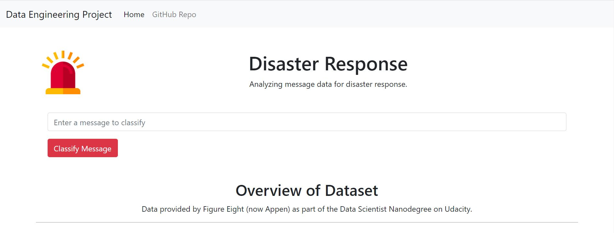
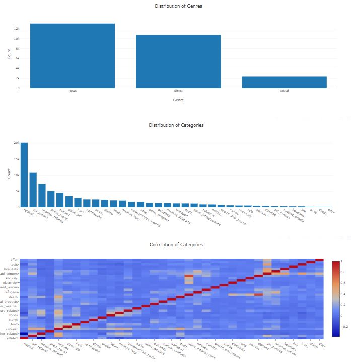

# Disaster Response Project
This project classifies real text messages, news and tweets sent during disaster events using a Machine Learning pipeline.
The data is visualized in a Flask Web App which also includes an API where users can input new messages and receive classification results.
The project is part of the Udacity Nanodegree in Data Science to train data engineering and software development skills.



## Required Installations
Python 3, Flask, Joblib, NLTK, Numpy, Pandas, Plotly, SciKit-learn and SQLalchemy.

## Instructions
1. Run the following commands in the project's root directory to set up your database and model.

    - To run ETL pipeline that cleans data and stores in database
        `python data/process_data.py data/disaster_messages.csv data/disaster_categories.csv data/Disaster.db`
    - To run ML pipeline that trains classifier and saves
        `python models/train_classifier.py data/Disaster.db models/classifier.pickle`

2. Run the following command in the app's directory to run your web app.
    `python run.py`

3. Go to http://127.0.0.1:5000/

## File Descriptions
The project consists of the following files:
```
Disaster_Response/  
│  
├── app/  
│   ├── static/  
│   │    ├── emergency-response.png   # image for styling the web app
│   ├── templates/  
│   │    ├── go.html   # html page showing classification results  
│   │    ├── master.html   # html page showing main page of Flask web app  
│   ├── run.py   # python file to run Flask app  
│  
├── data/  
│   ├── Disaster.db   # SQLite database to store cleaned disaster message data  
│   ├── disaster_categories.csv   # csv file containing categories of disaster messages  
│   ├── disaster_messages.csv   # csv file containing disaster messages  
│   ├── process_data.py   # python file to process data  
│  
├── models/  
│   ├── train_classifier.py   # python file to train classifier model  
│   ├── classifier.pickle   # pickle file containing trained model in binary (saved in Git LFS)  
│  
```
## Findings from Dataset Analysis


The visualizations show that the dataset for training the model was very imbalanced in terms of data points for the various categories. 
There was even one category "child_alone" which had no data points.
This imbalance has an effect on the various scores measuring the accuracy, precision, recall and f1-values, with the underrepresented categories also performing worse than categories with more data points.

## Acknowledgements
Data was provided by Figure Eight (now part of Appen) as part of the Udacity Nanodegree in Data Science.


